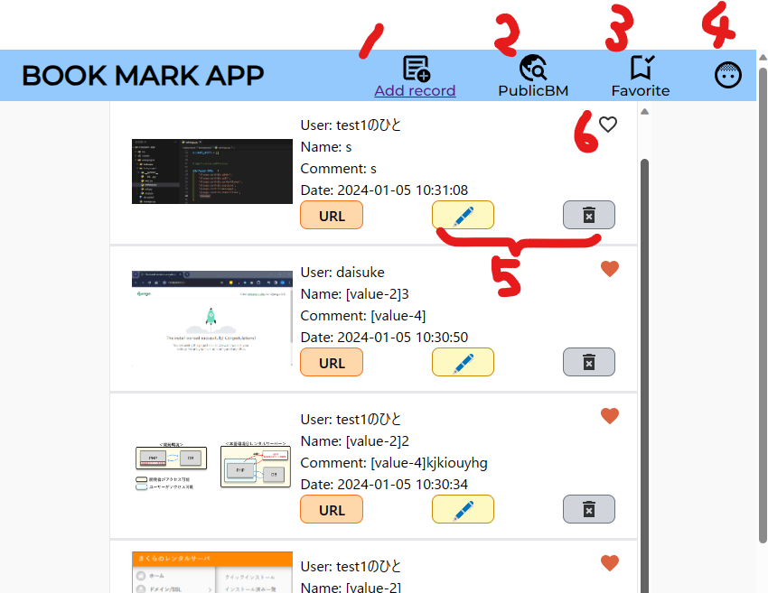

# ブックマークシェア＋ユーザー登録　改

##デプロイしたもの

[Bookmark APP](https://udon-dsuke.sakura.ne.jp/bookmark/)

***

## アプリの概要

- ユーザー情報(ユーザーID、パスワード、ユーザー表示名)を登録する機能を実装
- 登録したユーザーID、パスワードを使用した、ログイン・ログアウト機能を実装
- ログインしているユーザーの表示名をブックマーク情報に含めた状態で保存できる
- ユーザーお気に入り登録ができる

**※前回提出データのに対してデプロイ手法を調査・実施、一部スタイル機能調整を実施しました。**

## 使用方法
 1. **ユーザー登録**：ユーザーID、パスワード、ユーザー表示名を入力し、登録ボタンをクリック。 **⇒submit時にvalidation+DB照合が行われエラーが表示される**
 1. **ログイン**: ユーザーID、パスワードを入力しボタンをクリック。  **⇒⇒submit時にvalidation+DB照合が行われエラーが表示される**
 1. **ブックマーク登録**: 登録内容を明記しボタンをクリック  
 1. ブックマークのブックマークが可能

## メイン画面
###■デプロイに際したUI関連の変化点
- Favoriteボタンを♡アイコンに統一
- レスポンシブ化対応(画像アップは不可)->画像投稿はカメラが起動します
- tailwindCSS吐き出し、参照をCDN→CSS切り替え(動作がやっぱりちょっと遅かった)

1. ブックマークの追加
1. 他のユーザーがpublic公開しているbmを身に行ける(フィルタリング未完成)
1. 6でお気に入り登録しているもののみをフィルタリング
1. 簡易版ユーザー情報。ログアウトはこちらから。
1. 編集＆削除

## 苦労したところ[今回分] 
- 画像データ差し替え時、BM削除時に古い画像データを削除する機能の実装
- デプロイに向けた環境構築(下記を対応)
    - さくらレンタルサーバーのDB初期設定
    - FileZillaによるデータ転送
    - .sqlファイルインポート
    - アクセス制限の設定(img, .env)
    - .envファイルを使用したDB設定の外だし
      - PHP設定変更(環境変数の有効化)
      - COMPOSERの導入(dotenvクラス使用とサーバー側環境構築のため)
      - .env情報取得状況確認＠開発環境
      - DB接続を行っているクラスに$_ENVを読み取る処理を追加
    - サーバー側の準備(今後の勉強もかねてssh通信をCLIにて実施)
      - COMPOSER実行ファイル保存@home/bin下(標準でパスが通ている＝コマンド使用出来る階層)
      - composerインストール＠プロジェクトフォルダ vendorフォルダの生成を確認。＝開発環境と対応
      - .envファイルを作成(.env.exampleのコピーでもよかった)
      - .envの内容をviで編集(Esc/I/HJKI/:q!/:wqあたりのコマンドを習得)
    - 動作確認
      

---

# 機能まとめ [再掲] 

---

### ログインユーザー登録
- すでに登録されているユーザーidはメッセージが出て新規登録させない
- 簡単な正規表現を使った、入力記号の制限、メッセージ

- ログイン失敗時のアラート

### メイン画面
- iframeを使用した、画面内でのブックマーク一覧の表示 (更新タイミング早い順)
- ブックマーク追加ボタン->入力画面
- ブックマーク編集ボタン->上記の流用(URLパラメータで処理を分岐) 画像のアップロード機能を実装。input[type=file]はvalueを受け取れない仕様のため、非表示のinput[type-text]を別途用意し、ファイルパスを預けることにした。編集時に何も添付しなくても画像が維持されるようにした。(セキュリティ的にやっていいことなのかは不明) 
- ブックマーク削除機能->YES/NO確認ののち削除を実行
- お気に入りボタン(ハート)
- 参照リンクボタン->編集から登録しておくとリンクが新しいタブで開かれる
- フィルター機能
  - Public BM (ユーザーがパブリック公開しているBMを表示 
  - Favorite (ユーザーがお気に入り登録したBMを表示) 
  - ◀ Filter Reset (デフォルト状態に戻る＝ユーザーのBMのみ表示)
- ログアウト機能(坊主の少年アイコンから。DeleteUserは似たような処理になるので、スキップ。ログアウトと同じ挙動となっている) 

## さいごに
後で作業内容はまとめて共有しようかと思います。
